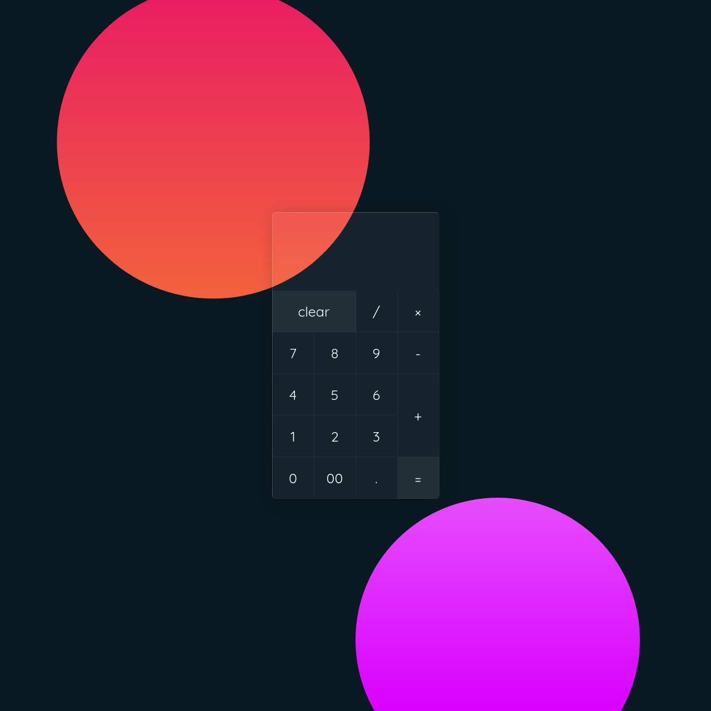

# Calculator App

A simple and elegant calculator app built using HTML, CSS, and JavaScript.

Try the calculator at: [Elegant Calculator](https://elegant-calculator.web.app)

## Features

- Basic mathematical operations: addition, subtraction, multiplication, and division
- A clean and modern user interface
- Vanilla-tilt.js library for a subtle tilt effect on button press

## How to Use

1. Enter a number by clicking on the corresponding buttons on the calculator.
2. Choose the mathematical operation you wish to perform by clicking the corresponding operator button (+, -, *, /).
3. Enter another number and press the "=" button to see the result.

## Technical details

This app uses Vanilla-tilt.js library to add a subtle tilt effect on button press. It also uses JavaScript to handle the calculator's logic and state. The CSS file is used to style and layout the calculator, giving it a clean and modern look.

## Credits

* Vanilla-tilt.js library by [Gijs Rogé](https://gijsroge.nl/)

## Limitations

This is a basic calculator example, it may not cover all the edge cases and you may need to add more features and handle the edge cases.

## License

This project is open-source and available under the [MIT License](LICENSE).

## Future Work

- Add more advanced calculations like square root, sin, cos, tan, and log.
- Add keyboard support for entering numbers and performing operations.
- Add memory functions like M+, M-, MC, MR, and MS.
- Add a dark mode for the calculator.

Please note that the above Screenshot is just for representation purpose, it may not match the final look of your calculator.
